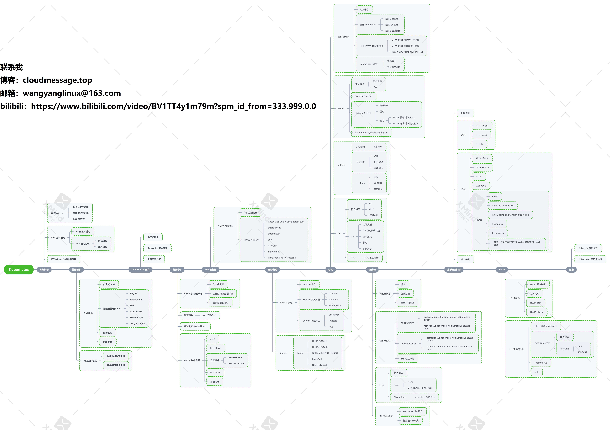
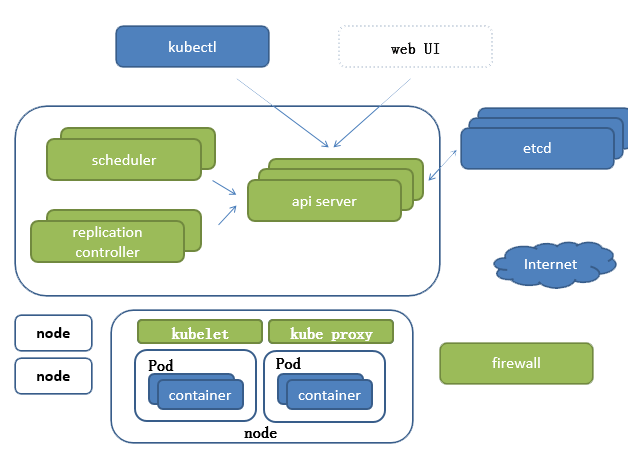
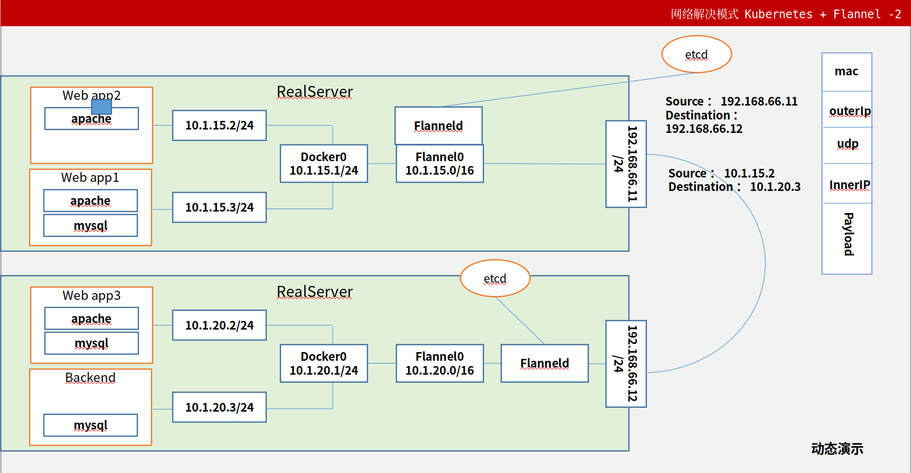
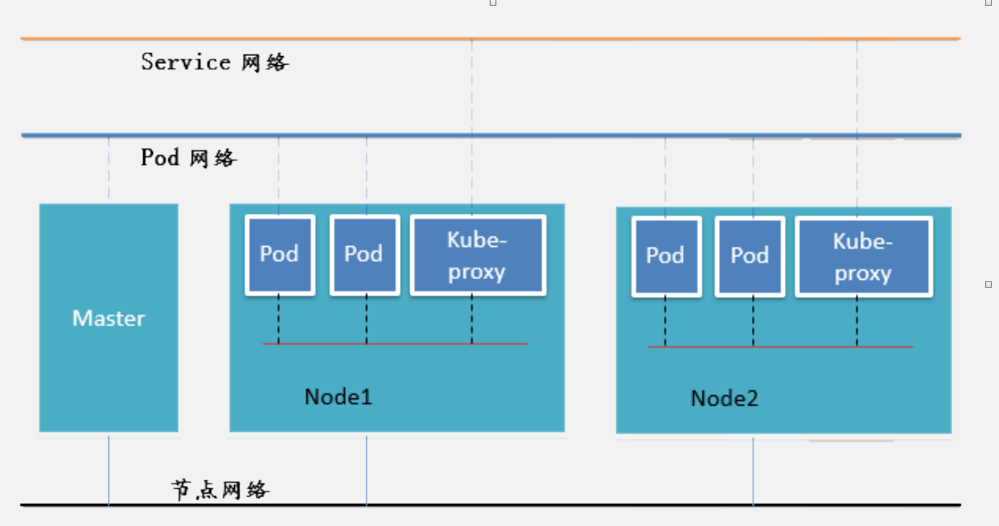

# Kubernetes 入门学习




## 特点

### 轻量级

### 开源

### 弹性伸缩

### 负载均衡


## Kubernetes架构图




## Master端组件

### Kubectl

* Kubernetes 的客户端，并不一定需要跟Kubernetes安装在一起，通过该客户端，可以向kubernetes发送命令，进行执行

### Kubernetes API Server

* 作为 Kubernetes 系统的入口，其封装了核心对象的增删改查操作，以 RESTful API 接口方式提供给外部客户和内部组件调用。维护的 REST 对象持久化到 Etcd 中存储

### Kubernetes Scheduler

* 新建立的 Pod 进行节点 (node) 选择(即分配机器)，负责集群的资源调度。组件抽离，可以方便替换成其他调度器

### Kubernetes Replication Controller

* 类似集群管家，保证集群稳定运行

* 如果有某个节点挂掉，或者宕机了，通过这个组件可以进行救活，重新启动。保证服务稳定性与高可用
* 负责维护集群的状态，比如故障检测、自动扩展、滚动更新等;

### Kubernetes etcd

* etcd 的官方将它定位成一个可信赖的分布式键值存储服务，它能够为整个分布式集群存储一些关键数据，协助分布式集群的正常运转
* Raft 从一开始就被设计成一个易于理解和实现的共识算法。每一个 Raft 集群中都包含多个服务器，在任意时刻，每一台服务器只可能处于 Leader、Follower 以及 Candidate 三种状态；在处于正常的状态时，集群中只会存在一个 Leader，其余的服务器都是 Follower
* 推荐在 Kubernetes 集群中使用 Etcd v3，v2 版本已在 Kubernetes v1.11 中弃用


## Node 组件 

### Kubelet

* 一个在集群中每个[节点（node）](https://kubernetes.io/zh/docs/concepts/architecture/nodes/)上运行的代理。 它保证[容器（containers）](https://kubernetes.io/zh/docs/concepts/overview/what-is-kubernetes/#why-containers)都 运行在 [Pod](https://kubernetes.io/docs/concepts/workloads/pods/pod-overview/) 中。承上启下
* kubelet 接收一组通过各类机制提供给它的 PodSpecs，确保这些 PodSpecs 中描述的容器处于运行状态且健康。 kubelet 不会管理不是由 Kubernetes 创建的容器。

### Kube-proxy

* [kube-proxy](https://kubernetes.io/zh/docs/reference/command-line-tools-reference/kube-proxy/) 是集群中每个节点上运行的网络代理， 实现 Kubernetes [服务（Service）](https://kubernetes.io/zh/docs/concepts/services-networking/service/) 概念的一部分。
* kube-proxy 维护节点上的网络规则。这些网络规则允许从集群内部或外部的网络会话与 Pod 进行网络通信。
* 如果操作系统提供了数据包过滤层并可用的话，kube-proxy 会通过它来实现网络规则。否则， kube-proxy 仅转发流量本身。

### Container Runtime(容器运行时)

* 容器运行环境是负责运行容器的软件。
* Kubernetes 支持容器运行时，例如 [Docker](https://kubernetes.io/zh/docs/reference/kubectl/docker-cli-to-kubectl/)、 [containerd](https://containerd.io/docs/)、[CRI-O](https://cri-o.io/#what-is-cri-o) 以及 [Kubernetes CRI (容器运行环境接口)](https://github.com/kubernetes/community/blob/master/contributors/devel/sig-node/container-runtime-interface.md) 的其他任何实现。

## 插件（Addons） 

* 插件使用 Kubernetes 资源（[DaemonSet](https://kubernetes.io/zh/docs/concepts/workloads/controllers/daemonset/)、 [Deployment](https://kubernetes.io/zh/docs/concepts/workloads/controllers/deployment/)等）实现集群功能。 因为这些插件提供集群级别的功能，插件中命名空间域的资源属于 `kube-system` 命名空间。

* 下面描述众多插件中的几种。有关可用插件的完整列表，请参见 [插件（Addons）](https://kubernetes.io/zh/docs/concepts/cluster-administration/addons/)。

### DNS 

* 尽管其他插件都并非严格意义上的必需组件，但几乎所有 Kubernetes 集群都应该 有[集群 DNS](https://kubernetes.io/zh/docs/concepts/services-networking/dns-pod-service/)， 因为很多示例都需要 DNS 服务。

* 集群 DNS 是一个 DNS 服务器，和环境中的其他 DNS 服务器一起工作，它为 Kubernetes 服务提供 DNS 记录。

* Kubernetes 启动的容器自动将此 DNS 服务器包含在其 DNS 搜索列表中。

### Web 界面（仪表盘）

* [Dashboard](https://kubernetes.io/zh/docs/tasks/access-application-cluster/web-ui-dashboard/) 是 Kubernetes 集群的通用的、基于 Web 的用户界面。 它使用户可以管理集群中运行的应用程序以及集群本身并进行故障排除。

### 容器资源监控

* [容器资源监控](https://kubernetes.io/zh/docs/tasks/debug/debug-cluster/resource-usage-monitoring/) 将关于容器的一些常见的时间序列度量值保存到一个集中的数据库中，并提供用于浏览这些数据的界面。

### 集群层面日志

* [集群层面日志](https://kubernetes.io/zh/docs/concepts/cluster-administration/logging/) 机制负责将容器的日志数据 保存到一个集中的日志存储中，该存储能够提供搜索和浏览接口。


# 基础概念

## Pod（最小单位，容器就在这里面运行）

* 一个pod中可以同时存在多个 容器，可以共享网络栈

### pause

* 初始化网络栈
* 挂载网络卷

### 自主式 Pod

* 自己管理自己，自己创建自己

## 1、控制器管理的Pod

### 控制器种类

```tex
ReplicationController & ReplicaSet & Deployment 
    > HPA（HorizontalPodAutoScale）
* StatefullSet
* DaemonSet
* Job，Cronjob 
```

#### ReplicationController

* ReplicationController 用来确保容器应用的**副本数始终保持在用户定义的副本数**，即如果有容器异常退出，会自动创建新的 Pod 来替代；而如果异常多出来的容器也会自动回收。
* 在新版本的 Kubernetes 中建议使用 ReplicaSet 来取代 ReplicationControlle

#### ReplicaSet

* ReplicaSet 跟 ReplicationController 没有本质的不同，只是名字不一样，并且 ReplicaSet 支持集合式的 selector

**虽然 ReplicaSet 可以独立使用，但一般还是建议使用 Deployment 来自动管理 ReplicaSet ，这样就无需担心跟其他机制的不兼容问题（比如 ReplicaSet 不支持 rolling-update(滚动更新) 但 Deployment 支持）**

#### Deployment

* Deployment 为 Pod 和 ReplicaSet 提供了一个声明式定义 (declarative) 方法，用来替代以前的 ReplicationController 来方便的管理应用。典型的应用场景包括：
  * 定义 Deployment 来创建 Pod 和 ReplicaSet
  * 滚动升级和回滚应用
  * 扩容和缩容
  * 暂停和继续 Deployment

#### Horizontal Pod Autoscaling

* Horizontal Pod Autoscaling 仅适用于 Deployment 和 ReplicaSet ，在 V1 版本中仅支持根据 Pod 的 CPU 利用率扩所容，在 v1alpha 版本中，支持根据内存和用户自定义的 metric 扩缩容

#### StatefulSet

* StatefulSet 是为了解决有状态服务的问题（对应 Deployments 和 ReplicaSets 是为无状态服务而设计），其应用场景包括：
    * 稳定的持久化存储，即 Pod 重新调度后还是能访问到相同的持久化数据，基于 PVC 来实现
    * 稳定的网络标志，即 Pod 重新调度后其 PodName 和 HostName 不变，基于 Headless Service （即没有 Cluster IP 的 Service ）来实现
    * 有序部署，有序扩展，即 Pod 是有顺序的，在部署或者扩展的时候要依据定义的顺序依次依次进行（即从 0 到 N-1，在下一个 Pod 运行之前所有之前的 Pod 必须都是 Running 和 Ready 状态），基于 init containers 来实现
    * 有序收缩，有序删除（即从 N-1 到 0）

#### DaemonSet 

* DaemonSet 确保全部（或者一些）Node 上运行一个 Pod 的副本。当有 Node 加入集群时，也会为他们新增一个 Pod 。当有 Node 从集群移除时，这些 Pod 也会被回收。删除 DaemonSet 将会删除它创建的所有 Pod

* 使用 DaemonSet 的一些典型用法：
    * 运行集群存储 daemon，例如在每个 Node 上运行 glusterd、ceph。
    * 在每个 Node 上运行日志收集 daemon，例如fluentd、logstash。
    * 在每个 Node 上运行监控 daemon，例如 Prometheus Node Exporter

#### Job，Cronjob 

* Job 负责批处理任务，即仅执行一次的任务，它保证批处理任务的一个或多个 Pod 成功结束


* Cron Job 管理基于时间的 Job，即：

    * 在给定时间点只运行一次

    * 周期性地在给定时间点运行


### 控制器分类（内置控制器，Kubernetes 中包含的，开发使用）

#### 有状态控制器

* StatefulSet

#### 无状态控制器

* **通用型**
  * ReplicationController	副本数量与期望值之间的管理
  * ReplicaSet     功能相似于RC，但是多了集合式的标签选择器
  * Deployment    支持滚动更新以及回关
* 特殊场景
  * 批处理任务：
    * Job   保障任务 一次 或 多次成功
    * Cronjob   在轮询状态下定期执行 Job 实现批处理任务的运行
  * 每个节点有且只有一个
    * DaemonSet ：	
  * 自动扩容索
    * Horizontal Pod Autoscaling：依赖于 Deployment 和 ReplicaSet 


## 2、网络通讯方式

* Kubernetes 的网络模型假定了所有 Pod 都在一个可以直接连通的**扁平的网络空间中**，这在 GCE（Google Compute Engine）里面是现成的网络模型，Kubernetes 假定这个网络已经存在。而在私有云里搭建 Kubernetes 集群，就不能假定这个网络已经存在了。我们需要自己实现这个网络假设，将不同节点上的 Docker 容器之间的互相访问先打通，然后运行 Kubernetes

### 2.1 Flannel

* Flannel 是 CoreOS 团队针对 Kubernetes 设计的一个网络规划服务，简单来说，它的功能是让集群中的不同节点主机创建的 Docker 容器都具有全集群唯一的虚拟IP地址。而且它还能在这些 IP 地址之间建立一个覆盖网络（Overlay Network），通过这个覆盖网络，将数据包原封不动地传递到目标容器内

  


#### ETCD 之 Flannel 提供说明：

* 存储管理 Flannel 可分配的 IP 地址段资源
* 监控 ETCD 中每个 Pod 的实际地址，并在内存中建立维护 Pod 节点路由表

###  2.2 网络通讯模式

#### 2.2.1 一个 Pod 内的多个容器之间

* 同一个 Pod 内部通讯：同一个 Pod 共享同一个网络命名空间，共享同一个 Linux 协议栈
* lo 各 Pod 之间的通讯：Overlay Network Pod 与 Service 之间的通讯：各节点的 Iptables 规则

#### 2.2.2 不同pod之间的通讯

* 同物理机
  * Docker0 网桥实现报文转发
  *  Pod1 与 Pod2 在同一台机器，由 Docker0 网桥直接转发请求至 Pod2，不需要经过 Flannel   

* 不同物理机
  * flannel、UDP 网桥实现报文转发
  * Pod1 与 Pod2 不在同一台主机，Pod的地址是与docker0在同一个网段的，但docker0网段与宿主机网卡是两个完全不同的IP网段，并且不同Node之间的通信只能通过宿主机的物理网卡进行。将Pod的IP和所在Node的IP关联起来，通过这个关联让Pod可以互相访问

#### 2.2.3 SVN 网络与 Pod 间的通讯

### 2.3 网络拓扑图




# 软路由的搭建

* 使用 ikuai 搭建三层网络结构
* 用ikuai的 iso文件，用虚拟机，搭建一个虚拟的路由器，**并且这个路由器设定两个网卡**  **一个 仅主机模式(内网调用)**，**一个 nat网络模式（链接外网使用）**
* 这样的话，就可以构建一个三层的网络体系
* 搭建ikuai后，
* 将路由器写入磁盘，并且修改lan端的接口
