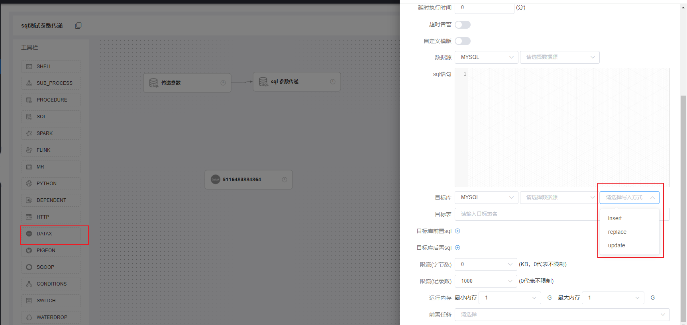
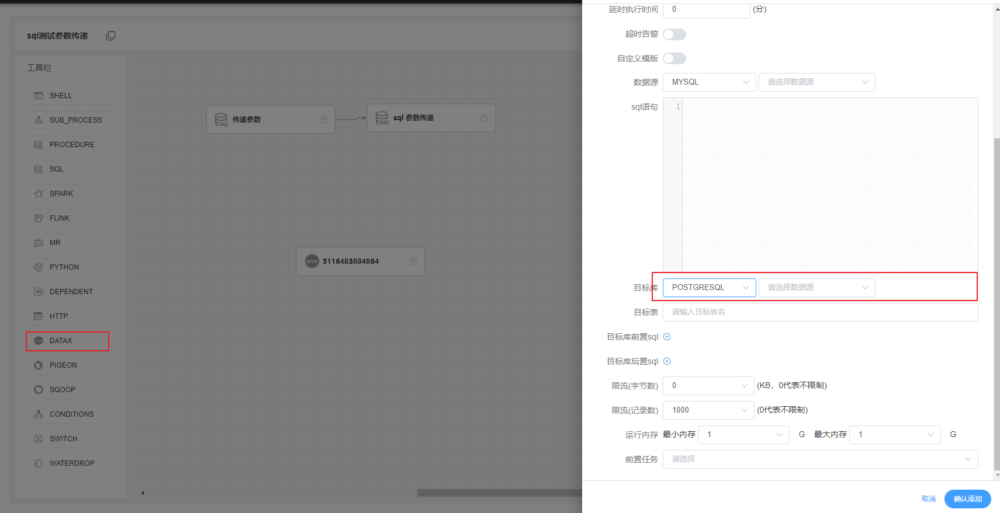

# DolphinScheduler 个性化修改（开发文档）

## 1、目的

### 原因

* 我们在使用datax将mysql的数据导入其它数据库或跨库操作时，原功能执行进行 insert 插入一种模式，会导致相同数据会写入数据库很多次，造成出现大量的重复数据，不利于数据的治理、也浪费数据库性能与存储

## 2、修改DataX组件

### 修改内容

* 写入Mysql数据库时增加 写入方式(insert 、replace、update)

### 修改后效果图

* 当选择Mysql数据库时，后面会出现 请选择写入方式的下拉框，会有三个选择值，insert、update、delete



* 
* 当选择的数据源不是 MySQL 数据库时，该选择框不会出现




## 3、前端修改

* 由相关的http请求，

  ```http
  http://10.166.147.18:38364/dolphinscheduler/ui/#/projects/5028986599616/definition/list/5036951711552
  ```

* 我们可以根据上面的请求，从 dolphinscheduler-ui/src/js/conf/home/router/index.js Vue的路由文件中得知，跳转到了这个页面

  * ../pages/projects/pages/definition/pages/details/index

  ```javascript
  {
      path: '/projects/:projectCode/definition/list/:code',
          name: 'projects-definition-details',
              component: resolve => require(['../pages/projects/pages/definition/pages/details/index'], resolve),
                  meta: {
                      title: `${i18n.$t('Process definition details')}`,
                          refreshInSwitchedTab: config.refreshInSwitchedTab
                  }
  },
  ```

* 然后在这个页面中 引用了 '@/conf/home/pages/dag/definitionDetails.vue' 这个Vue

  ```html
  <template>
    <m-definition-details></m-definition-details>
  </template>
  <script>
    import mDefinitionDetails from '@/conf/home/pages/dag/definitionDetails.vue'
    export default {
      name: 'definition-details-index',
      components: { mDefinitionDetails }
    }
  </script>
  ```

* 在 '@/conf/home/pages/dag/definitionDetails.vue' 这个Vue中 又加载了  <m-dag></m-dag> 这个组件

  ```html
  <template>
    <div class="home-main index-model">
      <m-dag v-if="!isLoading" :type="'definition'" :release-state="releaseState"></m-dag>
      <m-spin :is-spin="isLoading" ></m-spin>
    </div>
  </template>
  ```

* 在  <m-dag></m-dag> 这个组件中 引用了 <m-form-model></m-form-model> 这个组件

  ```html
  <m-form-model
                v-if="taskDrawer"
                :nodeData="nodeData"
                @seeHistory="seeHistory"
                @addTaskInfo="addTaskInfo"
                @close="closeTaskDrawer"
                @onSubProcess="toSubProcess"
                :type="type"
                ></m-form-model>
  ```

* 在  <m-form-model></m-form-model> 这个组件中 又使用了<m-datax></m-datax>

  ```html
  <m-datax
           v-if="nodeData.taskType === 'DATAX'"
           @on-params="_onParams"
           @on-cache-params="_onCacheParams"
           ref="DATAX"
           :backfill-item="backfillItem"
           >
  </m-datax>
  ```

* 最终需要修改的 就是 <m-datax></m-datax> dolphinscheduler-ui/src/js/conf/home/pages/dag/_source/formModel/tasks/datax.vue 这个VUE页面

### 3.1 修改内容

* 首先添加一个 select 下拉框

  ```html
  <div slot="content" style="display: inline-block" v-if="showInsertType">
      <el-select :placeholder="$t('Please select insert type')"
                 v-model="writeMode"
                 style="width: 150px;"
                 size="small"
                 :disabled="isDetails">
          <el-option
                     v-for="insertType in dataInsertTypeModel"
                     :key="insertType.insertType"
                     :value="insertType.insertType"
                     :label="insertType.insertType">
          </el-option>
      </el-select>
  </div>
  ```

* 在 Script 的 export default 的 data 中添加相关的 值

  ```less
  // Data Insert type
  showInsertType: false,
  // Data type
  writeMode: '',
  // Data Insert typeList
  dataInsertTypeModel: [],
  ```

* 配置相关的监听事件，当选择的数据源值发生改变时，改变对应的值，来确保

  * 1、该下拉框是否展示  showInsertType: false  为true时展示  默认false
  * 2、根据选择的数据源类型，创建对应的下拉框中的内容 即给 dataInsertTypeModel 赋值
  * 3、当选择下拉框中的值时，v-model="writeMode"  该 双向绑定属性，就能获取下拉框选的值，并赋值给 writeMode

  ```less
  watch: {
      // Watch the cacheParams
      cacheParams (val) {
          this._cacheParams()
      },
      // watch 中添加监听 dtType 值发生变化的事件 newQuestion: 变化后的值，oldQuestion: 变化前的值
      dtType: function (newQuestion, oldQuestion) {
          this.initDataInsertType(newQuestion)
      }
  }
  
  // 创建监听事件触发的方法
  initDataInsertType (newQuestion) {
      // 当选择的数据源为 'MYSQL' 时，初始化dataInsertTypeModel 数据
      if (newQuestion === 'MYSQL') {
          console.log('这是我需要的类型')
          // 将下拉框 改为可见
          this.showInsertType = true
          // 组装 dataInsertTypeModel数据
          this.dataInsertTypeModel = [
          {
              insertType: 'insert'
          },
          {
              insertType: 'replace'
          },
          {
              insertType: 'update'
          }
          ]
          console.log(this.writeMode + '获取的数值')
      } else {
          // 当选择的是其他值时，隐藏下拉框，并将下拉框的数据变为空
          this.showInsertType = false
          this.dataInsertTypeModel = []
      }
  }
  },
  ```


* 将相关字段添加到发送内容中

  ```less
  // storage
  this.$emit('on-params', {
      customConfig: this.customConfig,
      dsType: this.dsType,
      dataSource: this.rtDatasource,
      dtType: this.dtType,
      dataTarget: this.rtDatatarget,
      sql: editor.getValue(),
      writeMode: this.writeMode, // 向后发送内容时，添加写入类型字段
      maxBatchRows: this.maxBatchRows,
      maxBatchSize: this.maxBatchSize,
      flushInterval: this.flushInterval,
      targetTable: this.targetTable,
      jobSpeedByte: this.jobSpeedByte * 1024,
      jobSpeedRecord: this.jobSpeedRecord,
      preStatements: this.preStatements,
      postStatements: this.postStatements,
      xms: +this.xms,
      xmx: +this.xmx
  })
  ```

* 点击前台页面进行查看时，添加 后台传递过来的字段 添加到缓存

  ```less
  _cacheParams () {
      this.$emit('on-cache-params', {
          dsType: this.dsType,
          dataSource: this.rtDatasource,
          dtType: this.dtType,
          dataTarget: this.rtDatatarget,
          sql: editor ? editor.getValue() : '',
          writeMode: this.writeMode, // 点击查看时，将后台查询到的数据添加到缓存中
          maxBatchRows: this.maxBatchRows,
          maxBatchSize: this.maxBatchSize,
          flushInterval: this.flushInterval,
          targetTable: this.targetTable,
          jobSpeedByte: this.jobSpeedByte * 1024,
          jobSpeedRecord: this.jobSpeedRecord,
          preStatements: this.preStatements,
          postStatements: this.postStatements,
          xms: +this.xms,
          xmx: +this.xmx
      })
  },
  ```

* 当数据重新载入或保存时，刷新缓存内容

  ```less
  
        // Non-null objects represent backfill
        if (!_.isEmpty(o)) {
          // set jvm memory
          this.xms = o.params.xms || 1
          this.xmx = o.params.xmx || 1
          // backfill
          if (o.params.customConfig === 0) {
            this.customConfig = 0
            this.enable = false
            this.dsType = o.params.dsType || ''
            this.datasource = o.params.dataSource || ''
            this.dtType = o.params.dtType || ''
            this.datatarget = o.params.dataTarget || ''
            this.sql = o.params.sql || ''
            this.writeMode = o.params.writeMode || '' // 若为空，则设定一个默认值
            this.maxBatchRows = o.params.maxBatchRows || 0
            this.maxBatchSize = o.params.maxBatchSize || 0
            this.flushInterval = o.params.flushInterval || 0
            this.targetTable = o.params.targetTable || ''
            this.jobSpeedByte = o.params.jobSpeedByte / 1024 || 0
            this.jobSpeedRecord = o.params.jobSpeedRecord || 0
            this.preStatements = o.params.preStatements || []
            this.postStatements = o.params.postStatements || []
          } else {
            this.customConfig = 1
            this.enable = true
            this.json = o.params.json || []
            this.localParams = o.params.localParams || ''
          }
        }
  ```


## 4、后端修改

### 4.1 、修改点

* 在 DataxParameters 实体类中，添加新增的 插入方式字段,此处通过jackson将Json转换成对象类

  ```java
  /**
   * data insert type
   */
  private String writeMode;
  ```

  

* 在DataxTask 类中的 buildDataxJobContentJson(TaskRequest taskExecutionContext, DataxParameters dataXParameters) 方法中修改

  ```java
  // TODO 在此处添加 Mysql 写入方式
  if (StringUtils.isNotBlank(dataXParameters.getWriteMode())) {
      writerParam.put("writeMode", dataXParameters.getWriteMode());
  }
  ```


* 