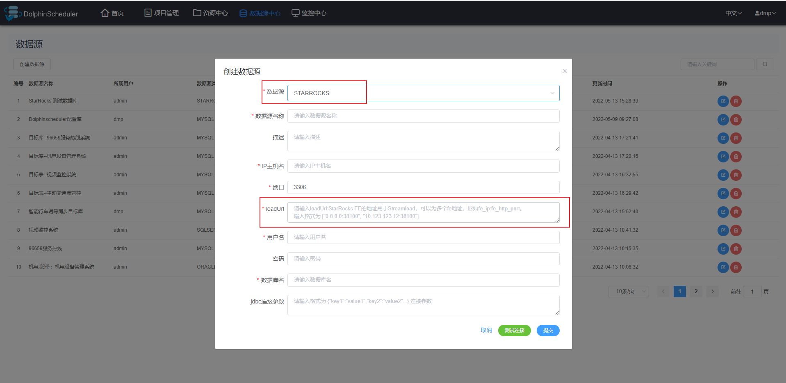
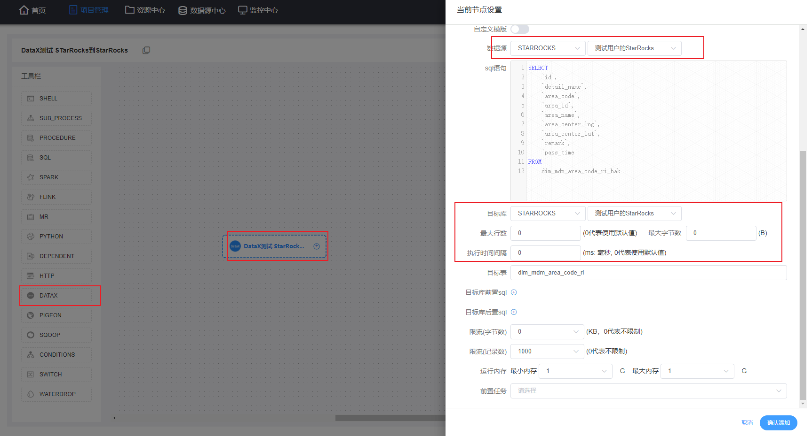

# Dolphinscheduler-Datax 添加StarRocks读写

## 1、背景

* 因为数据中台类似于一个数据仓库，用来处理存放数据的，所以必定会接入大量数据，而数据又分为好多种数据源
* 为了应对多元化的数据源，需要多少dolphinscheduler进行改写
* StarRocks使我们需要的、必不可少的一种数据源，有大量的数据在StarRocks中进行处理，所以对dolphinscheduler进行个性化改造


## 2、前端效果图

### 2.1、数据源-添加StarRocks数据库




### 2.2、修改Datax组件




## 3、前端修改内容

### 添加数据源页面修改


### 添加loadUrl 选项，并且是必填

```properties
"loadUrl": ["10.166.147.62:38100", "10.166.147.63:38100"]
```

```xml
<m-list-box-f v-if="showLoadUrls">
    <template slot="name"><strong>*</strong>{{$t('StarRocks loadUrl')}}</template>
    <template slot="content">
        <el-input
                  type="textarea"
                  v-model="loadUrl"
                  :autosize="{minRows:2}"
                  size="small"
                  :placeholder="$t('Place enter loadUrl')">
        </el-input>
    </template>
</m-list-box-f>
```


```js
# 添加
// loadUrl
loadUrl: '',
showLoadUrls: false,

    # watch 模块中添加
    
    if (value === 'STARROCKS' && !this.item.id) {
        this.showLoadUrls = true
        this.connectType = 'STARROCKS_SERVICE_NAME'
    } else if (value === 'STARROCKS' && this.item.id) {
        this.showLoadUrls = true
    } else {
        this.showLoadUrls = false
    }
```

